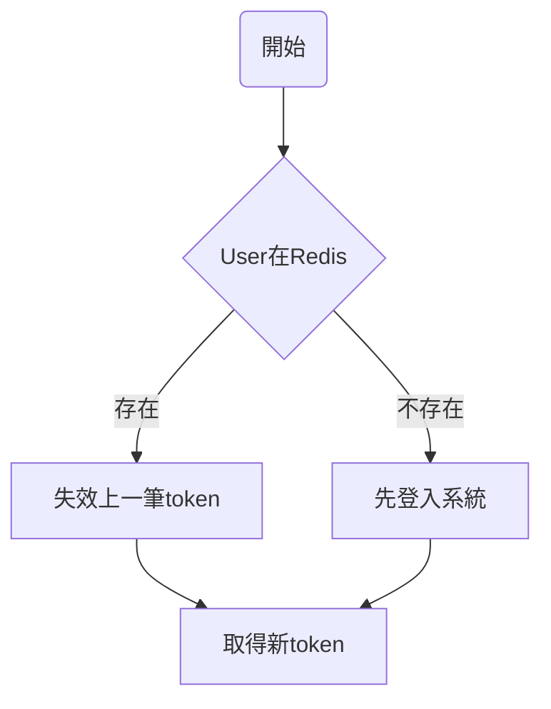

# Flask-JWT

- [Flask-JWT](#flask-jwt)
  - [需求](#需求)
  - [思考方向](#思考方向)
  - [JWT](#jwt)
    - [JWT 組成結構](#jwt-組成結構)
  - [Require module](#require-module)
  - [User.json](#userjson)
  - [新增和改動的部分](#新增和改動的部分)

> 參考[redis_blacklist.py](https://github.com/vimalloc/flask-jwt-extended/blob/master/examples/redis_blacklist.py)，依需求改寫。

需求
---
- 會員的帳號密碼記錄在database裡面，這邊用json file代替
- 登入成功後，得到token。在token有效期間內再次要求token時，會先把上一個token失效，再給一個新的

思考方向
---
當呼叫 ```login```API時




JWT
---
JWT(JSON Web Toekn) : 使用者登入或驗證身分後，後端會返回JWT token。使用者在該token有效時間內攜帶此token並對server發出request時，server驗證過token後就會回應使用者。

反之，若沒有攜帶token或是該token已經失效了，server就會回應需要重新登入。

### JWT 組成結構
- Header : type說明該token是JWT，alg表示使用的加密演算法是HS256。經過base64編碼後可以得到一串加密文字
```json
{
"alg": "HS256",
"typ": "JWT"
}
```
- Payload : 儲存使用者的狀態，一樣經過base64編碼加密

```
{
"iss": "Max",
"exp": "2020/12/31",
"iat": "2020/07/12",
"aud": "id0001",
"name": "Jason",
"admin": true
}
```

- Signature : 會先在Server建立一組secret,然後在把Header、Payload和這組Secret key做Hash加密

```
HMACSHA256(
  base64UrlEncode(header) + "." +
  base64UrlEncode(payload),
  secret_key
  )
```

Require module
---
- [Flask-JWT-Extended](https://github.com/vimalloc/flask-jwt-extended)
- Redis


User.json
---
模擬使用者帳號密碼在database，只有在這邊的帳號密碼能夠去取得token

當其他帳號要取得token時會被拒絕

key: 帳號

value:密碼
```json
{
    "user":{
        "testuser1":"testpwd1",
        "testuser2":"testpwd2"
}
}
```

新增和改動的部分
---

多使用了一個db去儲存使用者的帳號和token,方便去判斷使用者登入與否
```python
user_store = redis.StrictRedis(host='localhost', port=6379, db=1,
                                  decode_responses=True)
```

模擬讀取DB的動作，判斷該使用者是否存在DB，如不存在則回傳reject
```python
with open('user.json','r') as f:
    jsonfile = json.loads(f.read())
    if username not in jsonfile['user']:
        return "This user was rejected"
```

